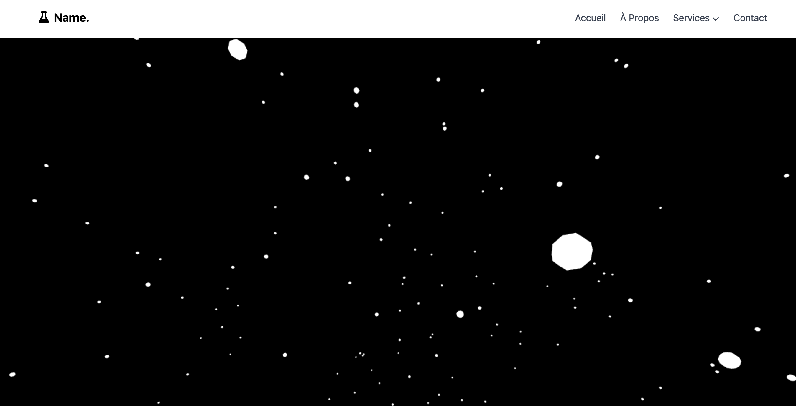

# Portfolio-Template

Un template de portfolio élégant et réactif construit avec HTML, CSS et TailwindCSS.

## Fonctionnalités

- **Design moderne** : un design épuré et contemporain qui mettra en valeur votre travail.
- **Responsivité** : s'adapte parfaitement à tous les appareils, qu'il s'agisse de smartphones, de tablettes ou d'ordinateurs de bureau.
- **Menu Burger** : un menu de navigation adaptatif qui s'affiche en fonction de la largeur de l'écran.
- **Google Fonts** : utilise la police Roboto pour un design propre et professionnel.
- **Section de contact** : un formulaire pour permettre aux visiteurs de vous envoyer un message directement depuis le site.

## Installation

1. Clonez ou téléchargez ce répertoire sur votre machine.
2. Ouvrez le fichier `index.html` dans votre navigateur pour afficher le template.
3. Personnalisez le contenu en fonction de vos besoins.
4. Assurez-vous d'avoir les liens vers les bibliothèques externes (comme TailwindCSS, etc.) pour que le design fonctionne correctement.

## Personnalisation

- Remplacez les images par vos propres travaux dans le dossier `images/`.
- Modifiez les textes pour refléter vos informations personnelles et professionnelles.
- Si nécessaire, ajoutez ou supprimez des sections pour correspondre à vos besoins.

## Contribuer

Les contributions sont toujours les bienvenues ! Si vous avez des suggestions d'améliorations ou souhaitez ajouter des fonctionnalités supplémentaires à cette navbar, n'hésitez pas à soumettre une demande de tirage (pull request) ou à ouvrir une issue.